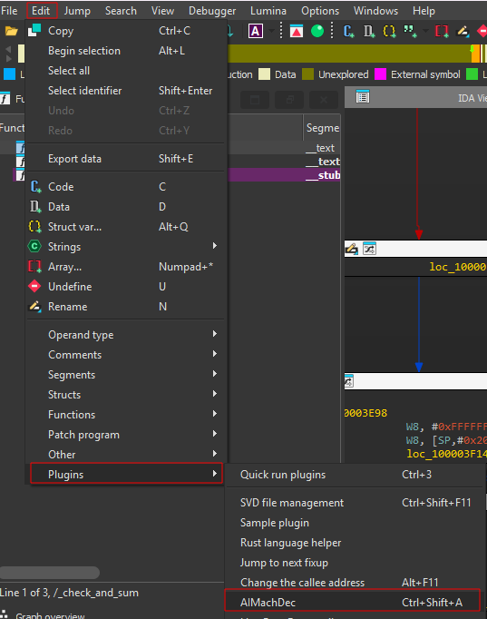
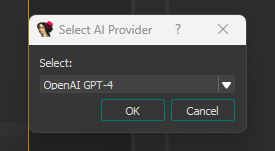
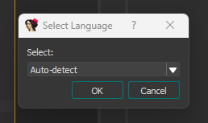
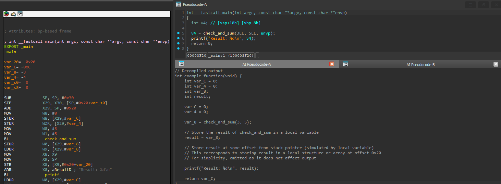

# AIMachDec

> Decompile AARCH64/ARM64 Apple binaries in IDA with the help of LLMs.


**AIMachDec** is an IDA plugin for Apple AARCH64/ARM64 binaries that utilizes LLMs to translate assembly functions into readable pseudo-code in C, Objective-C, or Swift. It:

* Uses LLMs to generate pseudo-code from ARM64 functions.
* Detects language context (C, Objective-C, Swift) or allows manual selection.
* Presents output in a clean, interactive viewer window ("AI Pseudocode-A/B/..."), similar to IDA's native decompiler.

This plugin is specifically designed for analyzing Apple Mach-O binaries, including iOS apps, kernelcaches, and dyld_shared_cache libraries.

Built using model prompts and structure from the [ipsw AI Decompiler from blacktop](https://blacktop.github.io/ipsw/docs/guides/decompiler/).

Supported models:

* OpenAI GPT-4
* Claude 3 Opus
* Ollama LLaMA 3
* Perplexity Sonar
* OpenRouter DeepCoder 14B (free)


## Installation

### Requirements

* IDA Pro version **8.4+**
* Python **3.x** with `requests` library

### Setup

1.  Install `requests` in a normal Python environment.
2. Copy these folders from `site-packages/` into `Lib/site-packages/` into IDA `\python\3\` folder.
3. Copy `AIMachDec.py` into your IDA plugins directory.
4. Restart IDA.


## Usage

1. Open a binary and navigate to the target function.
2. Set your API key as an environment variable in IDA's Python console. If not set, the plugin will print this instruction in the console. E.g.:
	```
	[AIMachDec] Missing API key: OPENROUTER_API_KEY
	[AIMachDec] Set it in the IDA python console like this:
	  import os
	  os.environ["OPENROUTER_API_KEY"] = "<api_key>"
	```
3. Use `Ctrl+Shift+A` or `Edit > Plugins > AIMachDec`.
4. Select an AI model and target language (or auto-detect).
5. View the decompiled result in a new AI Pseudocode window.

The plugin extracts the function's disassembly, constructs a prompt, and queries the selected LLM.


## Screenshots










## Compatibility

* **IDA Pro:** >=8.4
* **Platforms:** Windows, Linux, macOS
* **File Types:** Focused on Mach-O (Apple ARM64), partial support elsewhere


## TODO

* Add syntax highlighting to output viewer
* Support more LLM providers
* Implement local caching and context preservation per function